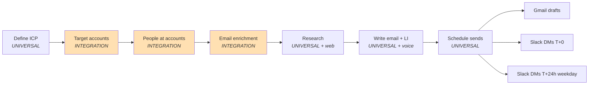

# AgentOperator Outbound Engine — Project Guide

## What this tool does

A 7-skill outbound engine for Claude Code. It takes you from a loose "we want to sell to X" idea to a Gmail inbox full of human-reviewable drafts + a Slack DM queue that tells you exactly when to hit send and exactly what LinkedIn copy to paste — all with varied-gap deliverability built in.

> **Original implementation note:** Built for Andy Toizer at Freckle. Peer customers referenced in the example (ClassDojo, BuildPass) are real Freckle customers. Swap for your own.

## Architecture



Each phase writes a handoff file. The next phase reads it. That means:
- A campaign can pause mid-run and resume in a new session.
- Nothing downstream runs against stale state — the handoff is the contract.
- If a gate fails (e.g. email hit rate < 80%), the plan forces you to fix it before moving on.

## Guided Setup

**If you just cloned this repo**, run `/plan-campaign` first. It walks you through the six phases end-to-end.

**If you want a specific capability**, jump to any individual skill — they work standalone.

### Step 1: Identify Your Stack

This tool was originally built with the following provider stack. Everything in `clients/` is swappable.

> **Recommended data provider stack**
>
> If you're starting fresh, here's the default this was built and tested with:
>
> | Need | Recommended default | Also works |
> |---|---|---|
> | People search | AI Ark + Apollo (Apollo via Claude MCP) | Clay, Sales Nav, LeadGenius |
> | Email enrichment | Lead Magic → Findymail waterfall | Hunter, Prospeo, Apollo, Clay |
> | Company enrichment | AI Ark | Clearbit, BuiltWith |
> | Draft creation | Claude Code Gmail MCP | google-auth-oauthlib (REST) |
> | Send reminders | Claude Code Slack MCP | Any Slack bot |
>
> The guided setup (below) asks for each category and maps your tools into the modular clients. You can mix and match — e.g., use your existing Apollo subscription for people search but add Lead Magic for email enrichment.

### Step 2: Adapt the Integration Layer

Each file in `clients/` has a banner at the top marking it INTEGRATION and noting what to change.

#### `clients/aiark.py` — people + company search

**What to change:** if you use Clay, Sales Nav, or another provider, replace the HTTP calls. Keep the function signatures (`people_search`, `company_search`, `reverse_people_lookup`) so `pipeline/people_search.py` keeps working.

**What to preserve:** the filter-building pattern (`any.include` / `exclude` / `all.include`) is powerful. Replicate the shape in your provider if possible.

#### `clients/leadmagic.py` + `clients/findymail.py` — email enrichment rungs

**What to change:** the HTTP calls for your rung-1 and rung-2 providers.

**What to preserve:** status normalization (`valid / catch_all / unknown / not_found`). The waterfall in `pipeline/enrichment.py` stops on `valid` or `catch_all` and falls through on anything else. Your replacement provider's `_normalize()` must map to the same shape.

#### `clients/gmail.py` + `clients/slack.py` — draft + DM spec builders

**What to change:** if you don't use Claude Code MCP, replace `to_mcp_args()` with the SDK calls for your provider (Gmail API, Slack Web API, etc.).

**What to preserve:** the `DraftSpec` / `DMSpec` dataclass shapes. The scheduler builds these and hands them off — decoupled from materialization.

### Step 3: Map Your Fields

The pipeline uses these internal field names on contact dicts. Map your provider's output to match:

| Internal field | What it's used for | AI Ark name |
|---|---|---|
| `first_name` | Greeting, email enrichment | `first_name` |
| `last_name` | Email enrichment | `last_name` |
| `full_name` | LI note, fallback for enrichment | `full_name` or `name` |
| `title` | Scoring, voice research | `experience.current.title` |
| `seniority` | Scoring, persona matching | `seniority` |
| `department` | Persona matching | `department` |
| `linkedin_url` | Enrichment rung 1, LI followup | `linkedin_url` |
| `company_name` | Drafting, Slack DM display | `account.name` |
| `company_domain` | Enrichment rung 2, dedup | `account.domain` |
| `persona_tier` | Scoring bucket | (assigned by `pipeline/people_search.py`) |

### Step 4: Configure Your Environment

Copy `.env.example` to `.env` and fill in:

- **`AI_ARK_API_KEY`** — [AI Ark developer portal](https://docs.ai-ark.com)
- **`LEADMAGIC_API_KEY`** — [Lead Magic dashboard → API keys](https://leadmagic.io)
- **`FINDYMAIL_API_KEY`** — [Findymail settings → API](https://findymail.com)
- **`APOLLO_API_KEY`** — optional (typically driven via Claude MCP)
- **`SLACK_USER_ID`** — your own user ID for DMs-to-self. Inside Claude Code, invoke the Slack MCP tool — its description prints your user ID.
- **`ANTHROPIC_API_KEY`** — only if you run research sub-agents standalone (typically handled by Claude Code itself)

Scheduler defaults are tunable in `.env` too (timezone, send window, daily cap, gaps).

### Step 5: Test

1. **Verify credentials** (non-negotiable test gate before any live run):
   ```bash
   python -c "from clients import leadmagic, findymail; print(leadmagic.credits(), findymail.credits())"
   ```

2. **Run the pipeline tests:**
   ```bash
   pip install pytest
   pytest tests/ -v
   ```

3. **Open the repo in Claude Code and try `/plan-campaign`** with a tiny batch size (3 contacts) to dry-run end-to-end.

## What Stays the Same (UNIVERSAL)

These files contain the core logic and should not need modification across providers:

- `pipeline/icp.py` — ICP schema + validator
- `pipeline/target_accounts.py` — scoring + dedup
- `pipeline/people_search.py` — persona-tier orchestration
- `pipeline/enrichment.py` — waterfall orchestrator (cached, resumable)
- `pipeline/research.py` — spec builder for sub-agents
- `pipeline/writer.py` — spec builder for drafting
- `pipeline/scorer.py` — shortlist ranking
- `pipeline/scheduler.py` — varied-gap planner + DM builders

## What Needs Adapting (INTEGRATION)

These files are provider-specific:

- `clients/aiark.py` — swap for your people-search provider
- `clients/leadmagic.py` — swap for your rung-1 email provider
- `clients/findymail.py` — swap for your rung-2 email provider
- `clients/apollo.py` — JSON parser for Claude-driven Apollo (optional)
- `clients/gmail.py` — swap for your email client
- `clients/slack.py` — swap for your notification channel

## Key Rules (Safety Invariants)

1. **Always run the credential test gate** before a live enrichment run. Misconfigured keys burn credits silently.
2. **Never invent stats in emails.** The voice rules (config/voice/email_patterns.md) ban this hard.
3. **Never use news signals older than 12 months** in the connector opener. Must be dated.
4. **The scheduler's per-day cap is a deliverability floor, not a target.** Don't override above 20/day without warmup.
5. **Scheduled Slack DMs are hard to edit via API.** Use the Slack UI's "Drafts and sent" view to adjust timings.
6. **Handoff files are the contract between phases.** If a phase starts without reading its input handoff, you'll run against stale state.

## Common Commands

```bash
# Install
pip install -r requirements.txt
cp .env.example .env   # then fill in keys

# Verify setup
python -c "from clients import leadmagic, findymail; print(leadmagic.credits(), findymail.credits())"

# Validate an ICP
python -c "from pipeline.icp import load_icp; print(load_icp('templates/icp.yaml').validate())"

# Run tests
pytest tests/ -v

# In Claude Code
/plan-campaign                           # start-to-finish guided flow
/define-icp                              # just the ICP step
/enrich-emails                           # just the enrichment waterfall
/schedule-sends                          # just the send scheduler
```

## Environment Variables

| Variable | Required | Description |
|---|---|---|
| `AI_ARK_API_KEY` | Yes (for people + company search) | B2B data platform |
| `LEADMAGIC_API_KEY` | Yes (for email enrichment) | Waterfall rung 1 |
| `FINDYMAIL_API_KEY` | Yes (for email enrichment) | Waterfall rung 2 |
| `APOLLO_API_KEY` | No | Optional — typically driven via Claude MCP |
| `SLACK_USER_ID` | Yes (for send reminders) | Your own ID for DMs-to-self |
| `SLACK_CHANNEL_ID` | No | Optional campaign log channel |
| `GMAIL_SENDER` | No | Only for REST mode; MCP doesn't need it |
| `ANTHROPIC_API_KEY` | No | Only for standalone research sub-agents |
| `SEND_TIMEZONE` | No | Default `America/Los_Angeles` |
| `SEND_WINDOW_START_HOUR` | No | Default 9 |
| `SEND_WINDOW_END_HOUR` | No | Default 12 |
| `SEND_PER_DAY_CAP` | No | Default 10 |
| `SEND_MIN_GAP_MIN` | No | Default 11 |
| `SEND_MAX_GAP_MIN` | No | Default 18 |
| `LI_DELAY_HOURS` | No | Default 24 |
