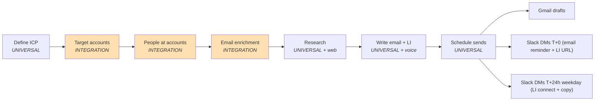

# AgentOperator Outbound Engine

Built by [Andy Toizer](https://www.linkedin.com/in/andy-toizer/) — Head of Growth at [Freckle](https://freckle.io) and author of the [AgentOperator newsletter](https://agentoperator.substack.com/), where I write about building real things with Claude Code agents instead of talking about the future tense of "AI at work."

**TLDR:** A 7-skill outbound engine you drive with Claude Code. Define an ICP, build a ranked target list, find the right buyers at each account, enrich emails via waterfall, research every company, draft email + LinkedIn in your voice, then schedule sends with varied timing and Slack DM reminders carrying the LinkedIn URL and the exact copy you need.

Built and tested on a live 15-contact batch at Freckle — 10 companies across EdTech and ConstructionTech, using peer-customer connector hooks. Drafts were iterated 15+ rounds per email to lock the voice, then the scheduler fanned out Gmail drafts and 30 Slack DMs (15 email reminders + 15 LinkedIn followups at T+24h weekday delay).

## How It Works



Every step writes a handoff file, so a long campaign can split across sessions without losing state. The `/plan-campaign` skill orchestrates the whole flow — run it when you first clone the repo and it walks you through the six phases, or skip it and invoke any single skill directly.

## What's In The Box

**Skills** (Claude Code slash commands):
- `/plan-campaign` — orchestrator that plans the full run in phases
- `/define-icp` — turn a fuzzy hypothesis into a validated `icp.yaml`
- `/build-target-accounts` — rank companies from the ICP
- `/find-people-at-accounts` — persona-tier search per account
- `/enrich-emails` — Lead Magic → Findymail waterfall
- `/research-company-and-contact` — parallel sub-agents find dated signals
- `/write-email-and-linkedin` — voice-locked drafting with connector opener
- `/schedule-sends` — send sheet → Gmail drafts + Slack DMs with deliverability spacing

**Pipeline** (`pipeline/`, universal logic):
- `icp.py` — ICP schema + validator
- `target_accounts.py` — search + score + dedupe
- `people_search.py` — persona-tier search orchestrator
- `enrichment.py` — cached, resumable waterfall
- `research.py` — spec builder for parallel research sub-agents
- `writer.py` — draft spec builder (voice + research + contact)
- `scorer.py` — shortlist ranking within (account, tier) buckets
- `scheduler.py` — varied-gap send planner + Slack DM builders

**Clients** (`clients/`, swappable integrations):
- `aiark.py` — people + company search (primary)
- `leadmagic.py` — email enrichment, rung 1
- `findymail.py` — email enrichment, rung 2
- `apollo.py` — stub + JSON parser for Claude-driven Apollo flows
- `gmail.py` — draft spec builder (Gmail MCP)
- `slack.py` — DM spec builder (Slack MCP)

**Voice** (`config/voice/`):
- `andys_voice.md` — example voice doc; replace with your own
- `email_patterns.md` — locked structural rules (connector opener, LI 1/2 + 2/2, no em dashes, etc.)

**Templates**:
- `icp.example.yaml` — example ICP (EdTech K-12 SaaS)
- `CAMPAIGN_PLAN.md` — master plan scaffold
- `HANDOFF_PHASE_N.md` — per-phase handoff scaffold
- `SEND_SHEET_example.md` — send sheet format

## Quick Start

### Prerequisites

- Python 3.10+
- [Claude Code](https://claude.com/claude-code) (the skills are designed to run inside Claude Code, driving the Gmail + Slack MCP tools)
- Accounts: AI Ark, Lead Magic, Findymail. Optional: Apollo.

### Easiest install (Claude Code desktop app)

Open the Claude Code desktop app, paste this into the chat, and let Claude do the setup:

```
Install this repo: https://github.com/Andytoizer/agentoperator-outbound-workflow

Clone it into ~/Documents, run pip install -r requirements.txt, copy .env.example to .env,
then walk me through getting started.
```

Claude will clone, install, scaffold your `.env`, and read `CLAUDE.md` to get oriented. When it's done, type `/plan-campaign` to start your first campaign.

### Manual install

```bash
git clone https://github.com/Andytoizer/agentoperator-outbound-workflow.git
cd agentoperator-outbound-workflow
pip install -r requirements.txt
cp .env.example .env
# Fill in your API keys
```

### Install the skills

Copy each `skills/<name>/SKILL.md` to `~/.claude/skills/<name>/SKILL.md` (user-scoped) — or keep them in-repo and they'll be loaded automatically when Claude Code opens the repo.

### Run a campaign

Open the repo in Claude Code and type:

```
/plan-campaign
```

Claude asks 4 questions (who you sell to, batch size, start time, what's already in the repo), writes `CAMPAIGN_PLAN.md`, and walks you through the phases. Each phase writes a handoff file so you can pause and resume in a new session.

Or jump straight to any single skill if you know what you want:

```
/enrich-emails        # if you already have a contact list
/schedule-sends       # if you already have an approved send sheet
```

## Adapting to Your Stack

**Recommended defaults** (from the Freckle build — use them or swap in what you have):

| Need | Recommended | Also works |
|---|---|---|
| People + company search | AI Ark + Apollo | Clay, Sales Nav, LeadGenius |
| Email enrichment | Lead Magic → Findymail | Hunter, Prospeo, Apollo, Clay |
| Voice doc | Your own (replace `andys_voice.md`) | — |
| Gmail drafts | Claude Code Gmail MCP | google-auth-oauthlib (REST) |
| Slack DMs | Claude Code Slack MCP | Your team's Slack bot |

The `clients/` directory is the swap layer. Every client normalizes to a common return shape — replace the HTTP calls, keep the function signatures, and the pipeline keeps working. See [CLAUDE.md](./CLAUDE.md) for the full guided walkthrough of what to change for each provider swap.

## Worked Example

`examples/edtech_contech_batch1/` contains a sanitized version of the campaign this was built on — 10 EdTech + ConstructionTech companies, 15 contacts, ICP definition, research per company, approved send sheet with 8 sales-leader drafts + 7 SDR-manager A/B-split drafts (POC vs Loom offer), send schedule, handoff files per phase.

Names, emails, and LinkedIn URLs are masked. The shape is the lesson.

## Deliverability Built-Ins

- Varied 11-18 min gaps (non-uniform)
- 9am-12pm default send window
- Max 10 sends/day configurable
- 24h email → LI delay (weekdays only)
- Human click-to-send (Gmail drafts, not bulk API)
- `--test` gate required before any live enrichment run (prevents silent credit burn on misconfigured providers)

## Contributing

PRs welcome. This started as my personal outbound tool at Freckle, so there are rough edges and opinions baked in. If you adapt it to a different voice / stack / ICP shape and hit friction in the integration layer, a PR makes the next person's life easier.

## License

MIT
